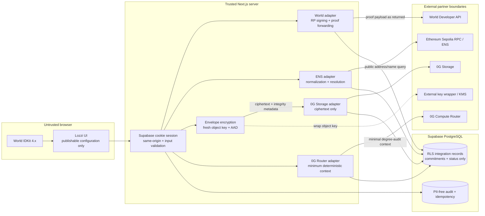

# Milestone 5 partner data flows

## Trust boundaries

## World verification

1. The authenticated student requests a short-lived RP context.
2. The server derives the fixed Lozzi action and binds the request to that
   student's non-public subject.
3. IDKit collects a proof through World App.
4. The browser returns the exact IDKit result to the server.
5. The server forwards it unchanged to the World v4 verification endpoint.
6. A transaction inserts the normalized nullifier once, records the verified
   signal, and appends a PII-free audit.
7. Duplicate nullifiers, signal mismatch, invalid proofs, and unavailable
   providers fail closed.

## ENS identity

1. The server receives a validated linked wallet address.
2. The resolver checks the configured Ethereum Sepolia source.
3. A resolved name is normalized before persistence.
4. No-name is stored as a successful lookup with no public name; it is not
   fabricated.
5. Subname issuance remains a separate adapter action and cannot run unless the
   configured parent and authorized signer are present.

## Encrypted 0G object

1. Lozzi canonicalizes the private object payload in memory.
2. The server generates a 32-byte object key and 12-byte AES-GCM nonce.
3. Object type, institution, owner reference, and schema version are bound as
   authenticated additional data.
4. The object key is wrapped by an external wrapping boundary; only its opaque
   reference is retained.
5. 0G receives ciphertext only and returns a root hash and transaction
   reference.
6. PostgreSQL stores the root hash, ciphertext commitment, encryption metadata,
   status, and wrapping-key reference—never the object key or plaintext.

## 0G progress explanation

1. Lozzi reads the student's deterministic, current degree-audit result.
2. A policy mapper produces the minimum structured context and request
   commitment.
3. The server sends the context to the configured 0G Router model.
4. The returned JSON is parsed and validated against the domain schema.
5. Valid output receives a response commitment and is returned to the student.
6. Invalid or failed output is recorded as failed and never displayed as an
   explanation.

## Failure independence

Every external request has a timeout, bounded response size, safe error
category, and idempotency key. Partner failure does not roll back an existing
SIS record, degree audit, grade, or enrollment. Retrying cannot create a second
logical verification, object, or inference run.
