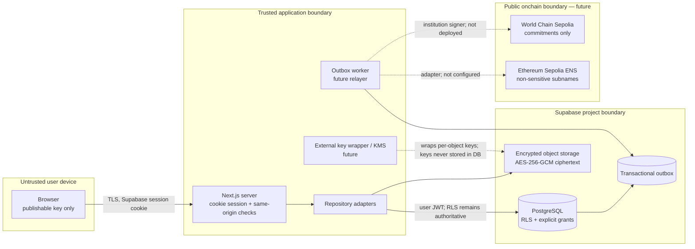

# System architecture and trust boundaries

## Trust decisions

- The browser is hostile. It receives a publishable Supabase key and scoped
  records only; no service-role, signer, wrapping, or deployment keys.
- The server validates the cookie session, origin, inputs, and capability
  state, but PostgreSQL memberships and assignments remain the authorization
  source of truth.
- Private objects are encrypted before persistence using a fresh AES-256-GCM
  key per object. PostgreSQL may hold an object reference and wrapping-key
  identifier, never plaintext keys.
- The outbox atomically records intended partner/onchain work with the domain
  change. Workers are idempotent and may fail without rolling back the SIS.
- Only salted commitments and bounded event metadata become public. No student
  names, emails, course titles, grades, wallet links, or arbitrary strings are
  permitted in the registries.

## State-transition audit

| Transition                   | Caller                                               | Motivation                               | If no caller                       |
| ---------------------------- | ---------------------------------------------------- | ---------------------------------------- | ---------------------------------- |
| Register institution         | registry owner                                       | onboard an approved institution          | institution remains unavailable    |
| Set institution admin/signer | active institution admin                             | rotate least-privilege operators         | prior scoped authority remains     |
| Commit record version        | active institutional signer                          | publish a verifiable academic commitment | offchain SIS remains canonical     |
| Create/revoke share grant    | active institutional signer relaying student consent | satisfy a student-authorized share       | no public share is created/revoked |

Nothing is automatic. A later worker pays gas, retries the outbox item, and
records the receipt. Milestones 0–1 deliberately stop before that worker or
signer is configured.
