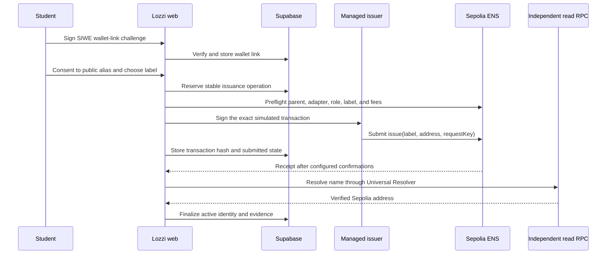

# ENS real-integration plan

Status: Phase 1 implemented locally; deployment preparation is in progress. No
name registration, Safe creation, contract deployment, approval, funding, or
live transaction has been performed.

This plan turns the existing Sepolia ENS boundary into an operable integration
without weakening Lozzi's privacy or availability guarantees. The target result
is one opt-in institutional alias that resolves to a wallet the student proved
they control. It is not an academic credential, a transferable entitlement, or
a replacement for the authoritative SIS.

## Current readiness

The repository now has:

- a non-upgradeable, parent-bound `InstitutionalEnsRegistrar` with immutable
  official ENS dependencies, Safe ownership, issuance-only authority, pausing,
  contract idempotency, and strict ERC-1155 receipt checks;
- a server-only Sepolia provider using `viem`, independent read/write RPCs,
  managed JSON-RPC signing, transaction simulation, fee ceilings, three
  confirmations, event verification, and forward-resolution read-back;
- runtime checks for registrar bytecode, immutables, official ENS contracts,
  wrapped-parent ownership/expiry/approval, issuer, and the approved Safe owner
  set and threshold;
- an ERC-4361 wallet-link challenge that persists only nonce/message hashes and
  supports EOA and ERC-1271 verification through `viem`;
- generated, PII-independent aliases plus explicit wallet-link and
  public-blockchain consent;
- a durable database lifecycle with exclusive broadcast authority, transaction
  evidence, reconciliation by indexed request key, wallet replacement, and
  Safe-clearing revocation states;
- authenticated same-origin student routes and a separately authenticated
  internal reconciliation route;
- unit, fuzz, TypeScript, React, and pgTAP test sources plus a read-only
  deployment verifier;
- non-blocking capability states when ENS is unavailable.

Real activation remains blocked by these operational gates:

1. The parent label, 2-of-3 Safe owner addresses, renewal period, Sepolia
   budget, RPC providers, and managed signer operator have not been approved.
2. The parent, Safe, adapter, approval, deployment block, and code hash do not
   exist yet and therefore cannot populate runtime configuration.
3. Foundry is unavailable in the current workstation environment, so the
   authored Solidity unit/fuzz suite and Sepolia-fork simulation have not run.
   `solcjs` compilation succeeds, but that is not a substitute for the gate.
4. Local pgTAP execution is blocked until Docker/Supabase services are
   available; the database lifecycle test is authored but not yet executed.
5. The Safe revocation transaction template, renewal owner, alerting, and
   reconciliation schedule still require operator assignment and rehearsal.
6. Forward issuance intentionally does not set a wallet's ENS primary/reverse
   name. The product must continue to say so.

The transaction-by-transaction procedure and evidence fields are in the
[ENS operator runbook](ens-operator-runbook.md).

## Chosen v1 architecture

Use Ethereum Sepolia, chain ID `11155111`, only. The parent name remains
operator-supplied until its availability and privacy-safe spelling have been
approved.

### Ownership and authority

- Register the `.eth` parent to a dedicated 2-of-3 institutional Safe, then
  wrap it. After wrapping, the official Name Wrapper holds the underlying
  registrar/registry position and the Safe owns the wrapped ERC-1155 name.
- Wrap the parent with the official Sepolia ENS Name Wrapper. Do not lock it or
  burn irreversible fuses for v1.
- Deploy a small, non-upgradeable `InstitutionalEnsRegistrar` whose owner is the
  Safe. The Safe grants Name Wrapper operator approval only to this adapter.
  Because that approval applies to every wrapped name the Safe owns, use an
  ENS-dedicated Safe that holds no unrelated names or assets; the adapter code
  must still be bound to exactly one parent.
- Give one KMS-backed service address the adapter's `ISSUER` role. The service
  address must never own the parent, administer the adapter, expose an arbitrary
  call, or receive a Safe owner key.
- The Safe owns each issued wrapped subname. The student's verified address is
  the resolver target, not the token owner. This is deliberately a revocable
  institutional alias and must be described that way in the consent UI.
- The Safe can revoke the adapter approval or rotate the issuer. A compromised
  issuer can spend its limited testnet gas and request new labels, but cannot
  transfer the parent, change configuration, or call unrelated ENS contracts.

The adapter must pin the parent node, Name Wrapper, and selected Public Resolver
as constructor immutables. Its issuance entry point should accept only a
normalized label, resolved address, and stable request key. The current
`parentNode` function argument must be removed so a caller cannot redirect the
adapter to a different namespace. The contract must independently enforce the
same 3-32 character lowercase ASCII letter/number/internal-hyphen policy as the
server so a caller cannot bypass it by invoking the issuer directly.

The adapter performs one atomic issuance:

1. validate the label and nonzero address;
2. bind the request key to a hash of the label and resolved address;
3. reject an existing label or a reused key with different inputs;
4. read the current parent expiry;
5. temporarily create the wrapped subname with the adapter as owner;
6. set only the default EVM address record in the selected Public Resolver;
7. finalize the record with the Safe as owner, the selected resolver, zero TTL,
   no burned fuses, and an expiry bounded by the parent;
8. emit an event indexed by request key, label hash, and resolved address.

The temporary ownership step follows ENS's documented same-transaction resolver
flow. The adapter must implement the ERC-1155 receiver interface, accept wrapped
names only from the official Name Wrapper during issuance, and prove that no
token remains owned by the adapter when the call returns.

An exact replay returns the existing node without creating another subname. The
adapter must have no payable path, fee logic, proxy, persistent token custody,
text-record writer, reverse-record writer, arbitrary external call, or general
parent parameter. Temporary receipt of the newly minted wrapped subname is the
sole token-handling exception. Parent renewal and child-expiry extension need a
separate, Safe-approved maintenance design before any long-lived launch.

The official ENS subname-registrar guidance assumes a wrapped parent, and the
official deployment list is the address source of truth. At deployment time,
verify the Sepolia Name Wrapper, Public Resolver, Universal Resolver, and
Registry addresses again from the
[ENS deployment registry](https://docs.ens.domains/learn/deployments/), then
check chain ID and nonempty bytecode through the configured RPC. Do not copy
addresses from an issue, chat, or old deployment artifact.

### Request and confirmation flow

The core dashboard remains usable during every failure in this sequence.

## Wallet proof and consent

Add a Sign-In with Ethereum flow before enabling issuance:

- create a single-use, hashed nonce bound to the authenticated student, expected
  HTTPS origin, Sepolia chain ID, intended wallet address, and a short expiry;
- use an ERC-4361 message that states the wallet will be linked to Lozzi;
- validate domain, URI, chain ID, nonce, issued/expiry times, address, and
  signature, including ERC-1271 contract-wallet verification where supported;
- consume the challenge transactionally and only then mark the wallet verified;
- revoke the old wallet link before accepting a replacement;
- require a second explicit confirmation that the chosen ENS name and wallet
  address will be public and remain visible in chain history.

ERC-4361 requires a relying-party nonce and binds the signed message to a domain,
URI, chain ID, and time. The implementation must follow the
[final ERC-4361 specification](https://eips.ethereum.org/EIPS/eip-4361), not a
free-form `personal_sign` message.

For the pilot, generate privacy-safe aliases rather than deriving labels from a
name, email, student number, course, or existing pseudonymous database ID. Use
3-32 lowercase ASCII characters with internal hyphens, a reserved-word list,
and an onchain availability preflight. Custom labels can be considered later
after moderation and privacy review.

## Durable issuance lifecycle

Reserve database state before signing anything. Extend `ens_identities`, or add
a tightly scoped operation table, with:

- a stable UUID request ID and its onchain request-key hash;
- normalized name, label hash, intended wallet, adapter, resolver, and chain ID;
- `pending`, `submitting`, `submitted`, `confirmed`, `active`, `failed`,
  `revocation-pending`, and `revoked` lifecycle timestamps;
- transaction hash, block number, confirmation count, and error category;
- uniqueness for request ID, transaction hash, network/name hash, and one
  nonterminal or active claim per student.

Replace the post-transaction-only `record_ens_identity` flow with service-role
RPCs that reserve, mark submitted, finalize, fail, and reconcile an operation.
Each transition must compare the expected prior state and bind the request ID to
the same student, wallet, label, and adapter.

If submission succeeds but storing the hash fails, a reconciler must search the
adapter's indexed issuance event from its deployment block using the stable
request key. It then verifies the receipt and resolution before finalizing. A
retry must inspect the reservation, contract request mapping, and matching event
before it is allowed to submit another transaction.

Wallet revocation takes effect in Lozzi immediately, but it cannot erase chain
history. It moves an active alias to `revocation-pending` and creates an
institutional Safe operation to clear the resolver address. Only after an
independent read confirms the address is cleared does the identity become
`revoked`. The UI must hide the alias as active during that interval and explain
that historical name/address events remain public.

## Runtime and operational controls

- Replace production use of `ENS_SIGNER_PRIVATE_KEY` with a signer abstraction
  backed by KMS or an equivalent managed signing service. Keep raw-key support
  for ignored local development only.
- Use a primary Sepolia RPC for simulation/submission and an independent RPC for
  receipt and Universal Resolver read-back. Fail closed if they disagree.
- Require three confirmations by default, configurable upward.
- Before every write, verify chain ID, adapter bytecode/code hash, immutable
  parent and ENS addresses, wrapped-name ownership, adapter approval, issuer role,
  parent expiry, label availability, signer balance, nonce, and fee bounds.
- Keep both a maximum gas limit and maximum total fee. Rate-limit per student,
  account, IP risk bucket, and institution; allow one active alias per student.
- Fund the issuer only for a bounded Sepolia canary window. Alert on unexpected
  transactions, balance changes, role changes, approvals, parent expiry, and
  resolution drift.
- Monitor parent renewal at 180, 90, and 30 days. No release is allowed without
  an owner-assigned renewal runbook and tested child-expiry extension path.
- Record only public routing evidence and operational categories. Never add ENS
  text records containing academic or personal data.

The implementation should replace the current runtime schema with explicit,
server-only settings for:

| Setting                           | Purpose                                      |
| --------------------------------- | -------------------------------------------- |
| `NEXT_PUBLIC_ENS_PARENT`          | Public normalized parent name                |
| `ENS_PARENT_SAFE_ADDRESS`         | Expected wrapped-name and adapter owner      |
| `ENS_PARENT_SAFE_OWNERS`          | Approved comma-separated Safe owner set      |
| `ENS_PARENT_SAFE_THRESHOLD`       | Approved Safe signature threshold            |
| `ENS_REGISTRAR_ADDRESS`           | Verified institutional adapter               |
| `ENS_REGISTRAR_CODE_HASH`         | Approved runtime-bytecode fingerprint        |
| `ENS_REGISTRAR_DEPLOYMENT_BLOCK`  | Lower bound for reconciliation event queries |
| `ENS_SEPOLIA_WRITE_RPC_URL`       | Simulation and submission transport          |
| `ENS_SEPOLIA_READ_RPC_URL`        | Independent confirmation/resolution path     |
| `ENS_SIGNER_PROVIDER`             | Managed signer implementation selector       |
| `ENS_SIGNER_ADDRESS`              | Expected managed issuer address              |
| `ENS_SIGNER_RPC_URL`              | Managed signing bridge, never key material   |
| `ENS_CONFIRMATIONS`               | Receipt threshold, default `3`               |
| `ENS_MAX_GAS` / `ENS_MAX_FEE_WEI` | Independent transaction ceilings             |
| `ENS_RECONCILIATION_SECRET`       | Internal worker authentication secret        |

`ENS_SIGNER_PRIVATE_KEY` remains an ignored local-test escape hatch and must be
rejected when the deployment environment is production.

Resolution verification must discover and check the configured resolver rather
than assuming every name uses one hardcoded implementation. ENS documents that
the Registry stores owner/resolver/TTL and that the Public Resolver permits the
name owner or approved operator to update records:
[Registry](https://docs.ens.domains/registry/ens/) and
[Public Resolver](https://docs.ens.domains/resolvers/public/). The temporary
ownership and ERC-1155 receiver sequence comes from the official
[subname registrar guide](https://docs.ens.domains/wrapper/creating-subname-registrar/).

## CROPS review

- **Censorship resistance:** the institution and Safe can revoke an alias, and
  the RPC or issuer can delay issuance. This is accepted because the name is a
  non-authoritative institutional alias. Once active, anyone can resolve it
  through another ENS client or RPC.
- **Rent and cost:** Sepolia gas and parent renewal are operational
  dependencies. The core SIS never depends on them, and budgets are bounded.
- **Openness:** the adapter, ABI, deployment metadata, and source verification
  remain public and reproducible. ENS Registry, Name Wrapper, and resolver
  interfaces are standard rather than provider-specific.
- **Privacy:** the alias-to-wallet relationship is public and durable. Issuance
  is opt-in, the default label is generated without PII, and no text, academic,
  World ID, or reverse-name record is written.
- **Security:** a 2-of-3 Safe controls ownership and recovery; a KMS address has
  issuance-only authority; database and contract idempotency are aligned; every
  success is verified through an independent read path.

The accepted compromise is institutional revocability. A trustless,
student-owned, emancipated subname would require different recovery, expiry,
abuse, and transfer decisions and is outside v1.

## Rollout

### Phase 0: decisions and approvals

- Approve the parent label, Safe owners and threshold, alias policy, revocation
  policy, parent duration, Sepolia budget, RPC providers, and KMS operator.
- Reconfirm Sepolia support in the
  [Safe supported-networks list](https://docs.safe.global/advanced/smart-account-supported-networks).
- Record that no production/mainnet claim is in scope.
- Obtain explicit approval before any registration, deployment, Safe approval,
  issuer funding, or live write.

### Phase 1: implementation

- [x] Implement SIWE challenge creation/verification and wallet revocation.
- [x] Implement the durable issuance state machine and issuance/revocation
      reconciler.
- [x] Implement the signer abstraction and independent read client.
- [x] Implement the minimal adapter plus unit and fuzz test sources.
- [x] Update the UI with public-link consent, institutional-revocation language,
      generated labels, pending/retry states, and a clear statement that no
      primary name is set.
- [ ] Execute the Solidity suite, invariant coverage, and Sepolia-fork tests
      against the real deployed ENS interfaces.

### Phase 2: security and deployment preparation

- Review the contract for authorization, replay, label collision, expiry,
  resolver permissions, ERC-1155 callbacks and stranded-token prevention,
  pausing, and recovery behavior.
- Simulate deployment and Safe transactions on a Sepolia fork.
- Produce deterministic deployment parameters, bytecode hash, ABI, source
  verification command, rollback/revocation steps, and an operator checklist.

### Phase 3: approved Sepolia provisioning

- Register the parent to the Safe and wrap it; verify the Name Wrapper's
  underlying custody plus the Safe's wrapped-token ownership, resolver, fuses,
  and expiry onchain.
- Deploy and source-verify the adapter with the Safe and ENS immutables.
- From the Safe, approve the adapter and configure the KMS issuer.
- Record addresses, transaction hashes, block numbers, code hash, ownership,
  roles, expiry, and explorer links in an evidence document.

### Phase 4: canary and pilot

- Issue one generated alias to a consenting synthetic Sepolia wallet.
- Prove forward resolution through the independent RPC.
- Replay the same request, restart the web process between submission and
  finalization, exercise reconciliation, and prove no duplicate issuance.
- Test unauthorized caller, reused key with changed input, occupied label,
  wrong chain, high fee, RPC disagreement, expired challenge, and revoked wallet
  failures, plus the Safe-controlled address-clearing path.
- Pilot only after the canary evidence and privacy/security review are accepted.

Mainnet, student ownership, primary-name setting, offchain/L2 subnames, fees,
marketplaces, and trustless fuses each require a new decision and are not
implicit follow-ons.

## Go-live evidence

The integration is `available` only when all of the following are recorded:

- official Sepolia ENS addresses rechecked and bytecode present;
- the official Name Wrapper holds the underlying wrapped name and the approved
  Safe owns its ERC-1155 token;
- Safe threshold and owners independently verified;
- parent expiry exceeds the approved safety window;
- adapter source verified and runtime code hash matches the approved build;
- adapter immutables match the parent and official ENS contracts;
- only the approved KMS address has issuance authority;
- adapter approval exists and unrelated approvals do not;
- SIWE replay, expiry, wrong-origin, wrong-chain, and ERC-1271 tests pass;
- database/contract idempotency and crash reconciliation pass;
- receipt has the configured confirmations;
- independent forward resolution equals the verified wallet;
- duplicate and collision attempts create no second identity or transaction;
- no PII, text record, primary-name claim, or academic authority is present.

Until then, the UI and capability record must remain `not-configured` or
`failed`; a simulated row or transaction preview is not live evidence.
