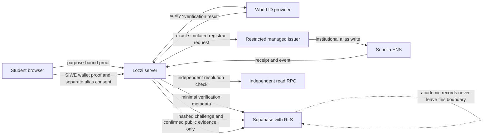

# World + ENS identity journey

Status: implemented and verified locally. World Portal resources have been
inspected, but the Lozzi runtime is not configured with an RP signing key. ENS
has not been provisioned or deployed, and no name has been issued.

> Lozzi is a privacy-first student information system where World verifies the
> person and ENS gives that student a readable, institution-issued digital
> identity. Academic records remain private and offchain, while the student
> controls wallet linking, identity consent, and record sharing.

## One progressive student journey

1. **Verify person.** The signed-in student completes Lozzi's
   `lozzi-student-verification` World action. The challenge is bound to the
   application user, purpose, action, environment, nonce, and signal.
2. **Verify wallet.** A real account-humanity verification unlocks a separate
   SIWE challenge. The student signs a time-bounded ERC-4361 message; this is
   not a transaction and does not consent to an ENS alias.
3. **Review identity.** Lozzi generates a neutral, PII-independent alias. The
   student explicitly consents to making only that alias and the verified
   wallet address public.
4. **Institution confirms.** The server reserves a durable issuance request.
   When the live ENS deployment is configured, the institution's restricted
   issuer can submit the parent-bound registrar call. The UI distinguishes
   prepared, pending, issued, failed, revocation-pending, and revoked states.

The real wallet and ENS routes fail closed unless the server can confirm a
current `account-humanity` World verification. A sensitive-share World step-up
cannot satisfy that account gate.

## Data flow and trust boundaries

| Boundary                | What crosses it                                                            | What must not cross it                                        |
| ----------------------- | -------------------------------------------------------------------------- | ------------------------------------------------------------- |
| Browser to Lozzi        | World response, SIWE signature, generated-alias consent                    | RP signing key, issuer credentials, Supabase service key      |
| Lozzi to World          | Purpose-bound verification request                                         | Academic records, enrollment, grades, student number          |
| Lozzi to Supabase       | Scoped World nullifier and time, verified wallet link, issuance lifecycle  | Raw World proof, wallet private key                           |
| Lozzi to ENS            | Neutral alias, verified wallet, stable request key, operational event data | Name, email, student number, grades, courses, World nullifier |
| Lozzi to managed signer | One simulated registrar transaction within configured limits               | Arbitrary calls, Safe owner authority, academic data          |

Raw World proof material is processed only for the verification request and is
not durably stored. The database retains the scoped nullifier, credential type,
purpose/environment metadata, and verification time needed to enforce
single-person and replay rules. SIWE challenge nonces and messages are stored as
hashes and consumed transactionally.

## What each integration means

### World proves

World proves only the credential configured for the selected Lozzi action. For
the account journey, that is the configured personhood claim associated with
`lozzi-student-verification`.

World does **not** prove:

- enrollment or admission;
- academic standing, grades, or degree progress;
- legal name, identity documents, or a student number;
- ownership of the subsequently linked wallet;
- affiliation with Northstar University or any other institution.

Lozzi binds the provider result to its own authenticated user and then uses a
separate SIWE proof for wallet ownership.

### ENS represents

ENS represents a readable, institution-issued routing alias that resolves to a
wallet the student proved they control. The institution's Safe retains
ownership so the current resolution can be revoked under institutional policy.

ENS does **not** represent:

- the authoritative student record or an academic credential;
- enrollment, graduation, good standing, or identity-document validation;
- student ownership of the wrapped subname;
- an ENS primary/reverse name;
- deletion of historical public events after revocation.

The authoritative SIS and academic record remain in Supabase under existing
authorization and RLS controls.

## Local/demo and live behavior

| Mode             | World behavior                                 | Wallet behavior                                                                  | ENS behavior                                                                                                         |
| ---------------- | ---------------------------------------------- | -------------------------------------------------------------------------------- | -------------------------------------------------------------------------------------------------------------------- |
| Not configured   | Verify button is blocked                       | Blocked until real World verification and wallet-read configuration exist        | No issued-name claim                                                                                                 |
| Local demo       | Clearly labeled mock result; no provider proof | Remains blocked with "Real proof required"                                       | With a previously verified synthetic wallet, can prepare `*.northstar.lozzi.test`; no ENS name or transaction exists |
| Live World only  | Provider-verified account-humanity state       | SIWE can operate when app origin and independent Sepolia read RPC are configured | Issuance remains unavailable until every deployment gate passes                                                      |
| Live World + ENS | Real World verification and SIWE               | Verified link can be revoked                                                     | Durable request progresses through pending/issued/failure states and is independently read back                      |

Mocks can run only in development. A mock verification is never persisted as a
live World result, never unlocks wallet linking, and never silently becomes a
real ENS request.

## Runtime configuration

Identifiers and policy values are not secrets, but still belong in controlled
runtime configuration rather than hard-coded deployment claims:

- `NEXT_PUBLIC_WORLD_APP_ID`
- `WORLD_RP_ID`
- `WORLD_ID_ENVIRONMENT`
- `NEXT_PUBLIC_ENS_PARENT`
- `ENS_PARENT_SAFE_ADDRESS`
- `ENS_PARENT_SAFE_OWNERS`
- `ENS_PARENT_SAFE_THRESHOLD`
- `ENS_REGISTRAR_ADDRESS`
- `ENS_REGISTRAR_CODE_HASH`
- `ENS_REGISTRAR_DEPLOYMENT_BLOCK`
- `ENS_SIGNER_PROVIDER`
- `ENS_SIGNER_ADDRESS`
- `ENS_CONFIRMATIONS`
- `ENS_MAX_GAS`
- `ENS_MAX_FEE_WEI`

Transport URLs may contain credentials and must be treated as secrets even
though local public endpoints may not:

- `ENS_SEPOLIA_WRITE_RPC_URL`
- `ENS_SEPOLIA_READ_RPC_URL`
- `ENS_SIGNER_RPC_URL`

The following must never be committed, printed, exposed to the browser, or
placed in evidence documents:

- `WORLD_RP_SIGNING_KEY`
- the World Developer Portal API key;
- `ENS_SIGNER_PRIVATE_KEY` or managed-signer credentials;
- `ENS_RECONCILIATION_SECRET`;
- credential-bearing RPC URLs;
- Safe owner keys, recovery phrases, or wallet private keys;
- `SUPABASE_SERVICE_ROLE_KEY`, database passwords, and encryption keys.

Raw private-key ENS signing is an ignored local-test escape hatch and is
rejected in production. The intended live design uses a restricted managed
signer.

## Live provisioning checklist

This checklist describes later operator work; it does not authorize any live
action.

### World

- [x] Inspect and reuse the Lozzi production external/cloud app.
- [x] Confirm production and staging RP registrations and all required action
      records.
- [ ] Obtain explicit approval before rotating the unrecoverable RP signing
      key, then store the replacement only in approved secret storage.
- [ ] Confirm required World product entitlements.
- [ ] Complete any required external-app metadata and obtain separate approval
      before a review submission; do not treat draft metadata as runtime proof.
- [ ] Run staging simulator evidence and production-device QA without capturing
      faces, documents, private screens, or proof bodies.
- [ ] Record replay, wrong-user, wrong-purpose, wrong-action, wrong-environment,
      expiry, and provider-failure evidence.

### ENS

- [ ] Approve the privacy-safe parent, dedicated 2-of-3 Safe owners, threshold,
      renewal owner, RPC providers, signer operator, and Sepolia limits.
- [ ] Obtain transaction-specific approval before creating a Safe, registering
      or wrapping a parent, deploying a registrar, granting approval, funding an
      issuer, or changing a resolver.
- [ ] Re-run the full local and Sepolia-fork gates.
- [ ] Verify official ENS dependencies, Safe ownership, bytecode, immutables,
      roles, approval, expiry, and code hash through the read-only verifier.
- [ ] Issue only a consenting synthetic canary after separate approval.
- [ ] Confirm the receipt, event, configured confirmations, and forward
      resolution through an independent RPC.
- [ ] Rehearse idempotent replay, restart/reconciliation, pause, issuer
      rotation, approval removal, renewal, and Safe-controlled clearing.

The detailed transaction sequence remains in the
[ENS operator runbook](ens-operator-runbook.md). Stop whenever a credential,
signature, approval, funding step, deployment value, or transaction is needed.

## 3-4 minute demo

**0:00-0:30 - Frame the problem.** Sign in as synthetic student Aisha Rahman.
Use the product story above and point out that her academic record stays in the
SIS rather than becoming a public blockchain profile.

**0:30-1:15 - Verify person.** Open **Identity & privacy**. Explain the exact
World claim and its limits, then show either a real configured verification or
the visibly labeled local demo. In demo mode, point out "Local demo only."

**1:15-2:00 - Verify wallet.** Show that the demo result cannot unlock wallet
linking. For a real configured flow, explain that SIWE proves control with a
single-use message, not a transaction, and that alias consent remains separate.

**2:00-2:45 - Review identity.** Generate the neutral alias. Show that the
student must opt in and that the alias contains no name, email, student number,
course, or grade. If ENS is not deployed, use the prepared-local state and state
that no ENS name or transaction exists.

**2:45-3:30 - Explain the institution boundary.** Describe the parent-bound,
Safe-owned registrar, restricted issuer, durable request key, and independent
resolution read-back. Show pending, issued, or failure UI only when supported by
the actual environment.

**3:30-4:00 - Close on privacy and control.** Return to the privacy summary:
raw World proofs are not stored, wallet linking and alias consent are separate,
academic data remains offchain, and the student controls record sharing.

## Judge-facing technical explanation

- World challenges are short-lived and bound to the authenticated Lozzi user,
  purpose, action, environment, nonce, and signal. The server verifies the
  signed provider response and consumes the challenge atomically to prevent
  replay.
- Account status selects only the `account-humanity` purpose. Share liveness or
  adult-consent step-ups cannot masquerade as account verification.
- ENS wallet-challenge, wallet-verification, and issuance routes independently
  enforce that account status. SIWE adds origin, URI, chain, address, nonce, and
  time binding, including ERC-1271 support.
- The registrar is non-upgradeable, bound to one parent and official ENS
  dependencies, Safe-owned, issuance-only, pausable, and idempotent by request
  key. The service stores transaction evidence and reconciles ambiguous
  broadcasts before any retry.
- Success requires configured confirmations plus independent forward-resolution
  read-back. The core SIS remains available when either partner is absent.

## Known limitations and follow-up

- The current World RP private signing key is unavailable. Live runtime
  verification remains blocked until an explicitly approved rotation and secure
  runtime configuration.
- Selfie Check and Identity Check entitlement state is not exposed by the
  current Portal inventory and still needs product-level confirmation.
- External-app store metadata remains incomplete and unsubmitted; no review
  status is claimed.
- ENS has no approved parent, Safe, registrar deployment, managed signer, RPC
  pair, or reconciliation scheduler. No live issuance evidence exists.
- The local ENS preview is intentionally synthetic and non-resolving.
- The v1 alias is institution-owned and revocable, and no primary/reverse name
  is set.
- Browser wallet support and Sepolia availability remain external dependencies.
- 0G code and documentation are preserved, but provisioning, funding,
  integration expansion, and demo claims are paused.
